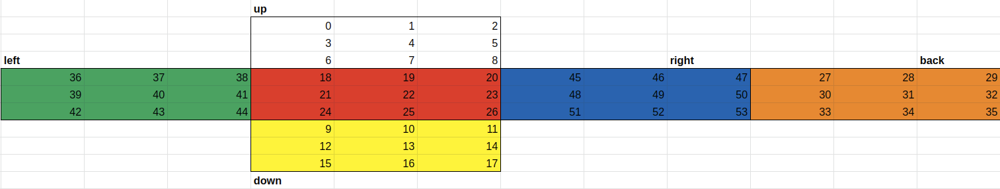

# 큐빙
> [시뮬레이션],[문제 URI](https://www.acmicpc.net/problem/5373)

> 루빅스 큐브를 돌린 후, 가장 윗면의 색상을 구하라

- `INPUT:` 돌리는 횟수, 돌리는 방법
- `OUTPUT:` 시뮬레이션 후, 가장 윗면의 색상

- `Condition(주의할 문제조건)`


## `1st try`

#### `Variables(변수: 데이터타입)`
#### `Algorithm`
  
```python

# "U+":B[2]->R[0]->F[0]->L[0]->B[0] (row),
# "U-":B[0]->L[0]->F[0]->L[0]->B[0] (row),
# "D+":F[2]->R[2]->B[2]->L[2]->F[2] (row),
# "D-":F[2]->L[2]->B[2]->R[2]->F[2] (row),
# "F+":U[2]->L->B->R,
# "F-":U->R->B->L,
# "B+":U[0]->L[]->D->R,
# "B-":U[0]->R->D->L,
# "L+":U[][0]->F->D->B(col),
# "L-":U[][0]->B->D->F(col),
# "R+":U[][2]->B->D->F(col),
# "R-":U[][2]->F->D->B(col),


dir2idx = {'U':0,'D':1,'F':2,'B':3,'L':4,'R':5}

compile_rotate = {
    "U+":((3,5,2,4),0,False),
    "U-":((3,4,2,5),0,False),
    "D+":((2,5,3,4),2,False),
    "D-": ((2, 4, 3, 5),2,False),
    "F+": ((0, 5, 3, 4),2,False),
    "F-": ((0, 4, 3, 5),2,False),
    "B+": ((0, 4, 1, 5),0,False),
    "B-": ((0, 5, 1, 4),0,False),
    "L+": ((0, 2, 1, 3),0,True),
    "L-": ((0, 3, 1, 2),0,True),
    "R+": ((0, 3, 1, 2),2,True),
    "R-": ((0, 2, 1, 3),2,True),
}
for _ in range(int(input())):
    N = int(input())
    cube = [[[color]*3 for _ in range(3)] for color in ["w","y","r","o","g","b"]]
    rotates = [[r,*compile_rotate[r]] for r in input().split()]
    for r in rotates:
        cur,cube_idx,pos,col_flag = r
        if not col_flag:
            tmp_row = cube[cube_idx[-1]][pos][:]
            for idx in range(len(cube_idx)):
                tmp_row2 = cube[cube_idx[idx]][pos][:]
                cube[cube_idx[idx]][pos] = tmp_row
                tmp_row = tmp_row2[:]
        else:
            tmp_col = list(zip(*cube[cube_idx[-1]]))[pos]
            for idx in range(len(cube_idx)):
                tmp_col2 =list(zip(*cube[cube_idx[idx]]))[pos]
                for y,v in enumerate(tmp_col):
                    cube[cube_idx[idx]][y][pos]=v
                tmp_col = tmp_col2[:]

        cur_idx=dir2idx[cur[0]]
        if cur[1] == "+":
            cube[cur_idx] = [list(z) for z in zip(*reversed(cube[cur_idx][:]))]
        else:
            cube[cur_idx] = list(reversed([list(z) for z in zip(*(cube[cur_idx][:]))]))

        for c in cube:
            for row in c:
                print(''.join(row))
            print()
        print("----------------------------------------")

```

Back의 index랑 Right left index가 다르다 통일시켜주어야한다.


## `2nd try` (무식하게 모든 index 맞춰주기)


```
			up								
			0	1	2						
			3	4	5						
left			6	7	8		right                         back
36	37	38	18	19	20	45	46	47	27	28	29
39	40	41	21	22	23	48	49	50	30	31	32
42	43	44	24	25	26	51	52	53	33	34	35
			9	10	11						
			12	13	14						
			15	16	17						
			down								

```

```python
from sys import stdin
input = stdin.readline
#UDFBLR wyrogb
STR2IDX = {k:v for v,k in enumerate("UDFBLR")}
C2C = (
    (38,37,36,29,28,27,47,46,45,20,19,18),
    (42,43,44,24,25,26,51,52,53,33,34,35),
    (44,41,38,6,7,8,45,48,51,11,10,9),
    (2,1,0,36,39,42,15,16,17,53,50,47),
    (0,3,6,18,21,24,9,12,15,35,32,29),
    (8,5,2,27,30,33,17,14,11,26,23,20),
)

transposition = (
    (0,1,2,5,8,7,6,3),
    (9,10,11,14,17,16,15,12),
    (18,19,20,23,26,25,24,21),
    (27,28,29,32,35,34,33,30,),
    (36,37,38,41,44,43,42,39),
    (45,46,47,50,53,52,51,48),
)

COLOR = tuple(c for c in ["w","y","r","o","g","b"] for _ in range(9))
CLOCK = {"+":1,"-":3}

def rotate(s,c):
    global cube
    before_val = [cube[idx] for idx in C2C[s]]
    after_idx = C2C[s][3*c:]+C2C[s][:3*c]
    for a,b in zip(after_idx,before_val):
        cube[a] = b

    before_val = [cube[idx] for idx in transposition[s]]
    after_idx = transposition[s][2*c:]+transposition[s][:2*c]
    for a,b in zip(after_idx,before_val):
        cube[a] = b

for _ in range(int(input())):
    N = int(input())
    rotation = [_ for _ in input().split()]
    cube = [_ for _ in range(54)]
    for r in rotation:
        side,clock=list(r)
        rotate(STR2IDX[side],CLOCK[clock])
    for i in range(9)[::3]:
        print(''.join([COLOR[c] for c in cube[i:i + 3]]))
```

cube의 index는 고정되어있고, value값은 color의 index이다.
대응되는 면에 대하여 rotation을 따라서 cube의 값을 update 시켜주면 정답이 된다.
`c2c(cube2color)`나, `transposition`은 순서만 고정이라면 어떤 곳을 기준점으로 잡는지 의미없다.
